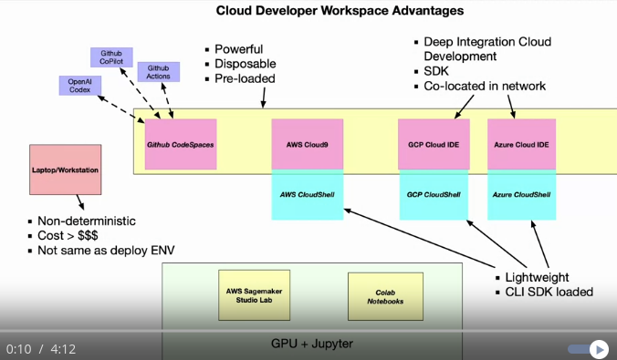

## Key Terms
- Codespace: Cloud-based, disposable development environments hosted by GitHub. Provide reproducibility and customization.
- Reproducibility: The ability to reliably recreate an environment and obtain the same results. Codespaces ensure this through containers.
- Container Image:  A lightweight, stand-alone, executable software package allowing code to run quickly and reliably across environments.
- GPU: Graphics processing units that accelerate machine learning model building/training with specialized hardware.
- Copilot: GitHub's AI pair programmer that suggests code and entire functions to developers as they type.
- Continous Integration: The development practice of frequently merging code changes and validating each change through automated build and test processes.
- Continous Delivery: Software methodology where teams can release new changes to users quickly, reliably and sustainably through automated deployments.

## Cloud Developer Workspace Advantage

## GitHub Echosystem
- codespace: reproducability
    - container image: docker image
    - configuration
    - compute and storage
- Access GPU: machine learning codespace
    - Huggingface
    - pytorch
    - tensorflow
    - nvidea Cuda
- AI coding assistent: Copilot
- Contiouns integration and Deployement: GitHub actions
    - Makefile
    - push imagaes to
        - AWS ESR
        - app runner
        - Fast API

## GitHub Templates
    - exmple template: microsoft/codespace-teaching-template-py
    - use this template
- template repository
    - setting -> Template repository